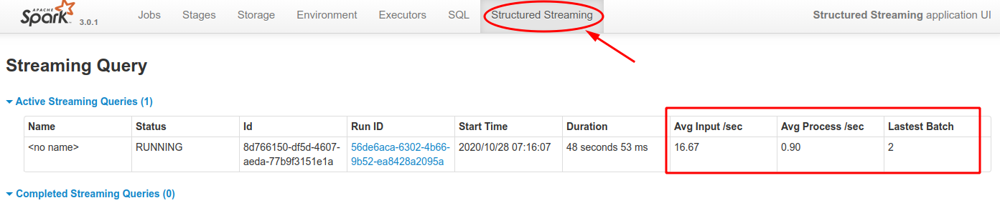

<link rel='stylesheet' href='../../assets/css/main.css'/>


# Lab - Structured Streaming - Windowed Word Count


### Overview

Doing wordcount with time windows using Spark Streaming

### Depends On

None

### Run time

20-30 mins


## STEP 1: Go to project directory

```bash
$ cd ~/dev/spark-labs/08-streaming/8.4-structured/python
```

## Step 2 : Inspect WordCountWindow.scala

Inspect file : `src/main/scala/structured/WordCountWindow.scala`

Notice how we are simulating event timestamp by using  
`withColumn ("timestamp", current_timestamp)`

Let's just run the file as is for now.

## Step 3: Build the project

```bash
    # be in project root directory
    $  cd ~/dev/spark-labs/08-streaming/8.4-structured
    $  sbt clean package
```


## Step 4: Run Netcat Server to simulate network traffic (terminal 1)

(Or leave the previous one running)

```bash
$   ncat -l -k -p 10000

# if this shows 'Port already in use', get the process is and kill the process
$ sudo netstat -plnt | grep 10000
# Process id will be shown in output
$ sudo kill -9 <process id>
```

## Step 5: Run the streaming application (Terminal 2)

```bash
# be in project root directory
$   cd ~/dev/spark-labs/08-streaming/8.4-structured

$   $SPARK_HOME/bin/spark-submit  --master local[2]   --driver-class-path logging/  \
       --class structured.WordCountWindow     target/scala-2.12/structured-streaming_2.12-1.0.jar 
```

## Step 6:  Enter some data (in ncat terminal 1)

In the Terminal 1, input some data, like below

```text
a
b
```

Inspect the output from Spark streaming on terminal 2

Notice the data

- `value` : has text we enter
- `timestamp` : event time, generated by Spark streaming

Output would be similar to the following (yours might be different)

```text
-------------------------------------------
Batch: 1
-------------------------------------------
+-----+-----------------------+------------+
|value|timestamp              |query       |
+-----+-----------------------+------------+
|a    |2020-10-30 21:49:59.643|query1-lines|
+-----+-----------------------+------------+

-------------------------------------------
Batch: 2
-------------------------------------------
+-----+-----------------------+------------+
|value|timestamp              |query       |
+-----+-----------------------+------------+
|b    |2020-10-30 21:50:00.461|query1-lines|
+-----+-----------------------+------------+
```

## Step 7 - TODO-1 : Split lines into words

Edit file : `src/main/scala/structured/WordCountWindow.scala`

Uncomment the code block around TODO-1.

This will split the input line into words

Run this file and observe the output

## Step 8: Compile and run the application

```bash
    # be in project root directory
    $  cd ~/dev/spark-labs/08-streaming/8.4-structured
    $  sbt clean package

    $   $SPARK_HOME/bin/spark-submit  --master local[2]   --driver-class-path logging/  \
       --class structured.WordCount     target/scala-2.12/structured-streaming_2.12-1.0.jar 
```

## Step 9:  Enter some data (in ncat terminal 1)

In the Terminal 1, input some data, like below

```text
a
a b
a   b   c
```

Inspect the output on streaming terminal 2.

**Q==>Inspect how words are split working?**

```console
-------------------------------------------
Batch: 1
-------------------------------------------

+-----+-----------------------+------------+
|value|timestamp              |query       |
+-----+-----------------------+------------+
|a    |2020-10-30 21:55:48.351|query1-lines|
|a b  |2020-10-30 21:55:48.351|query1-lines|
+-----+-----------------------+------------+

+----+-----------------------+------------+
|word|timestamp              |query       |
+----+-----------------------+------------+
|a   |2020-10-30 21:55:48.351|query2-words|
|a   |2020-10-30 21:55:48.351|query2-words|
|b   |2020-10-30 21:55:48.351|query2-words|
+----+-----------------------+------------+


-------------------------------------------
Batch: 2
-------------------------------------------
+---------+-----------------------+------------+
|value    |timestamp              |query       |
+---------+-----------------------+------------+
|a   b   c|2020-10-30 21:55:49.017|query1-lines|
+---------+-----------------------+------------+

-------------------------------------------
Batch: 2
-------------------------------------------
+----+-----------------------+------------+
|word|timestamp              |query       |
+----+-----------------------+------------+
|a   |2020-10-30 21:55:49.017|query2-words|
|b   |2020-10-30 21:55:49.017|query2-words|
|c   |2020-10-30 21:55:49.017|query2-words|
+----+-----------------------+------------+
```

## Step 10 - Window Count

Edit file : `src/main/scala/structured/WordCountWindow.scala`

Uncomment the code block around TODO-2.

This will count words by time window

Run this file and observe the output

## Step 11: compile and run the application

```bash
    # be in project root directory
    $  cd ~/dev/spark-labs/08-streaming/8.4-structured
    $  sbt clean package

    $   $SPARK_HOME/bin/spark-submit  --master local[2]   --driver-class-path logging/  \
       --class structured.WordCount     target/scala-2.12/structured-streaming_2.12-1.0.jar 
```

## Step 12:  Enter some data (in ncat terminal 1)

In the Terminal 1, input some data, like below

```text
a
a b
a   b   c
```

Inspect the output on streaming terminal 2.


```console
-------------------------------------------
Batch: 3
-------------------------------------------
+-----+-----------------------+------------+
|value|timestamp              |query       |
+-----+-----------------------+------------+
|a b c|2020-10-30 22:05:31.932|query1-lines|
+-----+-----------------------+------------+

+----+-----------------------+------------+
|word|timestamp              |query       |
+----+-----------------------+------------+
|a   |2020-10-30 22:05:31.932|query2-words|
|b   |2020-10-30 22:05:31.932|query2-words|
|c   |2020-10-30 22:05:31.932|query2-words|
+----+-----------------------+------------+

-------------------------------------------
Batch: 3
-------------------------------------------
+------------------------------------------+----+-----+---------------------+
|window                                    |word|count|query                |
+------------------------------------------+----+-----+---------------------+
|[2020-10-30 22:05:30, 2020-10-30 22:05:40]|b   |1    |query3-windowedCounts|
|[2020-10-30 22:05:20, 2020-10-30 22:05:30]|a   |2    |query3-windowedCounts|
|[2020-10-30 22:05:30, 2020-10-30 22:05:40]|a   |1    |query3-windowedCounts|
|[2020-10-30 22:05:20, 2020-10-30 22:05:30]|b   |1    |query3-windowedCounts|
|[2020-10-30 22:05:30, 2020-10-30 22:05:40]|c   |1    |query3-windowedCounts|
+------------------------------------------+----+-----+---------------------+

```

## Step 13 - TODO-3: Order Couunts

Inspect TODO-3.

Go ahead and sort the output by time interval

`orderBy("window")`

Compile and run again:


```bash
    # be in project root directory
    $  cd ~/dev/spark-labs/08-streaming/8.4-structured
    $  sbt clean package

    $   $SPARK_HOME/bin/spark-submit  --master local[2]   --driver-class-path logging/  \
       --class structured.WordCount     target/scala-2.12/structured-streaming_2.12-1.0.jar 
```


## Step 14 - `Structured Streaming` UI

Inspect `Structured Straming` tab on Spark UI.

Note the active queries running.

Inspect stats of streaming.

<a href="../../assets/images/structured-steaming-1.png"></a>

<a href="../../assets/images/structured-steaming-2.png"></a>

## Step 12 - End Streaming App

**=>  Hit Ctrl+C  on terminal #1 to kill Spark streaming application**
